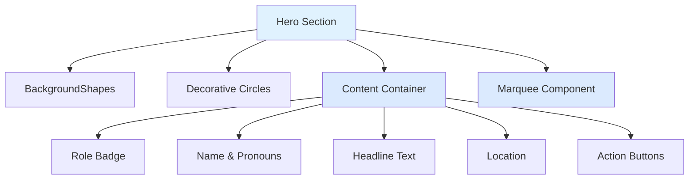
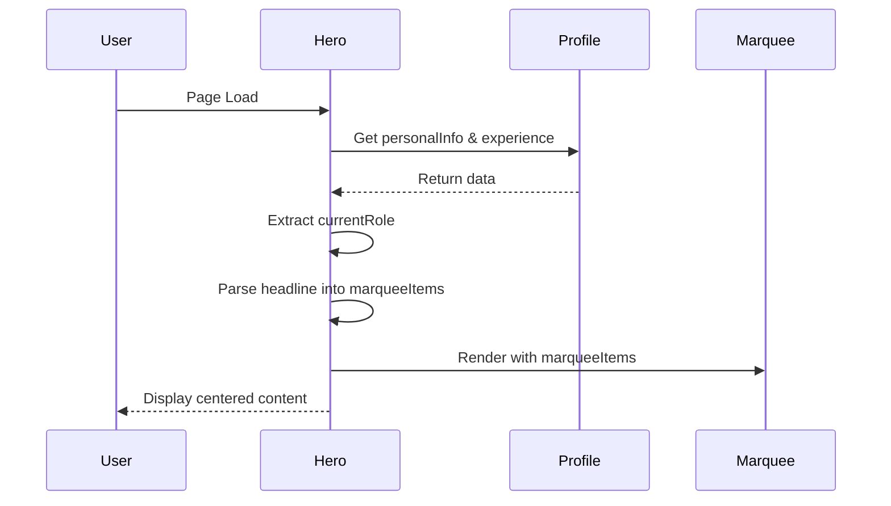

# Design Document: Center Hero Section Content

## Overview

This design removes the decorative initials box from the Hero section and centers all hero content to create a more focused, streamlined layout. The current implementation uses a two-column grid layout (lg:grid-cols-2) with content on the left and a decorative "NS" initials box on the right. The new design will eliminate the right column entirely and center all content elements (role badge, name, pronouns, headline, location, and action buttons) while maintaining the Marquee component at the bottom and preserving all decorative background elements.

The change affects only the layout structure and CSS classes, with no modifications to component logic or data handling. The responsive design will be simplified since the grid layout is no longer needed, and all content will be centered on both mobile and desktop viewports.

## Architecture

The Hero section follows a simple component architecture with no state management or complex interactions:



**Key Changes**:
- Remove the grid layout (lg:grid-cols-2)
- Remove the right column div containing the initials box
- Center the content container using flexbox or centered block layout
- Adjust max-width constraints for optimal readability

## Main Algorithm/Workflow



## Components and Interfaces

### Hero Component

**Purpose**: Display the main hero section with centered content, background decorations, and scrolling marquee.

**Interface**:
```typescript
export function Hero(): JSX.Element
```

**Responsibilities**:
- Fetch and display personal information from profile data
- Extract and format current role information
- Parse headline text into marquee items
- Render centered content layout with proper spacing
- Maintain responsive design across breakpoints
- Display background decorative elements

**Props**: None (uses imported profile data)

**State**: None (stateless functional component)

### Supporting Components

**BackgroundShapes**: Renders decorative SVG shapes in the background
**Marquee**: Displays scrolling text items parsed from headline
**Button**: Renders action buttons (Email, LinkedIn)

## Data Models

### PersonalInfo

```typescript
interface PersonalInfo {
  name: string
  pronouns: string
  headline: string
  location: string
  contact: {
    email: string
    linkedin: string
  }
}
```

**Validation Rules**:
- name must be non-empty string
- headline can contain pipe-separated items for marquee
- contact.email must be valid email format
- contact.linkedin must be valid URL

### Experience

```typescript
interface Experience {
  role: string
  company: string
  // ... other fields
}
```

**Validation Rules**:
- role must be non-empty string
- company must be non-empty string

## Core Interfaces/Types

```typescript
// Hero component signature
export function Hero(): JSX.Element

// Helper function for extracting initials (to be removed)
function initials(fullName: string): string

// Marquee items derived from headline
type MarqueeItems = string[]
```

## Key Functions with Formal Specifications

### Hero Component

```typescript
export function Hero(): JSX.Element
```

**Preconditions:**
- `profile` object is imported and contains valid `personalInfo` and `experience` data
- `personalInfo.name` is a non-empty string
- `personalInfo.headline` is a string (may contain pipe separators)
- `experience` array has at least one element (or is empty)

**Postconditions:**
- Returns valid JSX.Element representing the hero section
- All content is centered within the container
- Marquee component receives non-empty array of strings
- Background decorative elements are rendered
- Action buttons link to valid email and LinkedIn URLs

**Loop Invariants:** N/A (no loops in component logic)

### initials Function (to be removed)

```typescript
function initials(fullName: string): string
```

**Note**: This function will be removed as part of the design change since the initials box is being eliminated.

## Algorithmic Pseudocode

### Main Hero Rendering Algorithm

```typescript
ALGORITHM renderHero()
INPUT: None (uses imported profile data)
OUTPUT: JSX.Element representing centered hero section

BEGIN
  // Step 1: Extract data from profile
  personalInfo ← profile.personalInfo
  experience ← profile.experience
  contact ← personalInfo.contact
  currentRole ← experience[0] OR null
  
  // Step 2: Parse headline into marquee items
  marqueeItems ← personalInfo.headline
    .split('|')
    .map(trim)
    .filter(isNonEmpty)
  
  ASSERT marqueeItems.length > 0
  
  // Step 3: Render centered layout structure
  RETURN (
    <section id="hero" className="centered-layout">
      <BackgroundShapes />
      <DecorativeCircle position="left" />
      
      <CenteredContentContainer>
        IF currentRole EXISTS THEN
          <RoleBadge role={currentRole.role} company={currentRole.company} />
        END IF
        
        <Heading>{personalInfo.name}</Heading>
        <Pronouns>{personalInfo.pronouns}</Pronouns>
        <Headline>{personalInfo.headline}</Headline>
        <Location>{personalInfo.location}</Location>
        
        <ActionButtons>
          <Button href={contact.email}>Email me</Button>
          <Button href={contact.linkedin}>LinkedIn</Button>
        </ActionButtons>
      </CenteredContentContainer>
      
      <Marquee items={marqueeItems} />
    </section>
  )
END
```

**Preconditions:**
- profile data is loaded and valid
- personalInfo contains all required fields
- experience array is defined (may be empty)

**Postconditions:**
- Returns valid JSX structure
- All content is wrapped in centered container
- Marquee receives valid items array
- No initials box is rendered

**Loop Invariants:**
- During marquee items processing: all processed items are non-empty strings

## Example Usage

```typescript
// In App.tsx or main layout
import { Hero } from './sections/Hero'

function App() {
  return (
    <main>
      <Hero />
      {/* Other sections */}
    </main>
  )
}

// The Hero component renders with centered content:
// - Role badge (if current role exists)
// - Name heading
// - Pronouns
// - Headline text
// - Location with icon
// - Email and LinkedIn buttons
// - Marquee at bottom
```

## Layout Changes

### Current Layout Structure

```typescript
// Current: Two-column grid layout
<div className="grid lg:grid-cols-2 gap-10">
  <div className="relative">
    {/* Left column: All content */}
  </div>
  <div className="relative flex justify-center lg:justify-end">
    {/* Right column: Initials box */}
  </div>
</div>
```

### New Layout Structure

```typescript
// New: Single centered column
<div className="flex flex-col items-center text-center">
  <div className="max-w-2xl">
    {/* All content centered */}
  </div>
</div>
```

## CSS Class Changes

### Container Classes

**Remove**:
- `grid` - No longer using grid layout
- `lg:grid-cols-2` - No two-column layout
- `gap-10`, `lg:gap-12` - Grid gap no longer needed

**Add**:
- `flex flex-col` - Use flexbox for vertical stacking
- `items-center` - Center items horizontally
- `text-center` - Center text alignment

### Content Wrapper Classes

**Current**: `relative` (left column)

**New**: `max-w-2xl mx-auto` - Constrain width for readability and center

### Button Container Classes

**Current**: `flex flex-wrap gap-4`

**New**: `flex flex-wrap gap-4 justify-center` - Add center justification

## Responsive Behavior

### Mobile (< 768px)
- Content naturally centered
- Full-width buttons stack vertically if needed
- Decorative circle remains visible but positioned appropriately

### Tablet (768px - 1024px)
- Content centered with comfortable max-width
- Buttons remain in horizontal row
- Increased padding for breathing room

### Desktop (> 1024px)
- Content centered with max-width constraint (2xl = 42rem)
- All elements maintain center alignment
- Background decorations remain visible

## Correctness Properties

### Layout Properties

**Property 1: Content Centering**
```typescript
∀ viewport_width ∈ [320px, ∞): 
  hero_content.horizontal_position = (viewport_width - content_width) / 2
```
All content must be horizontally centered regardless of viewport width.

**Property 2: Vertical Stacking**
```typescript
∀ element ∈ hero_content_elements:
  element.display_order = [role_badge, name, pronouns, headline, location, buttons]
```
Elements must maintain consistent vertical order.

**Property 3: No Initials Box**
```typescript
∄ initials_box ∈ rendered_elements
```
The initials box must not exist in the rendered output.

**Property 4: Marquee Position**
```typescript
marquee.position = bottom_of_hero_section ∧
marquee.width = full_viewport_width
```
Marquee must remain at the bottom and span full width.

### Data Properties

**Property 5: Marquee Items Validity**
```typescript
∀ item ∈ marqueeItems:
  item.length > 0 ∧ item.trim() !== ""
```
All marquee items must be non-empty strings.

**Property 6: Current Role Display**
```typescript
(experience.length > 0) ⟹ (role_badge.visible = true) ∧
(experience.length = 0) ⟹ (role_badge.visible = false)
```
Role badge displays if and only if experience data exists.

## Error Handling

### Error Scenario 1: Missing Profile Data

**Condition**: profile.personalInfo is undefined or null
**Response**: Component should fail gracefully or show fallback content
**Recovery**: Ensure profile data is loaded before rendering Hero component

### Error Scenario 2: Empty Headline

**Condition**: personalInfo.headline is empty string or only whitespace
**Response**: marqueeItems becomes empty array after filtering
**Recovery**: Marquee component should handle empty array gracefully (show nothing or default message)

### Error Scenario 3: Invalid Contact URLs

**Condition**: contact.email or contact.linkedin is malformed
**Response**: Buttons may link to invalid destinations
**Recovery**: Validate URLs in profile data or add validation in Button component

## Testing Strategy

### Unit Testing Approach

**Test Cases**:
1. **Rendering with valid data**: Verify all content elements render correctly
2. **Rendering without current role**: Verify role badge is not displayed when experience array is empty
3. **Headline parsing**: Verify pipe-separated headline correctly splits into marquee items
4. **Empty headline handling**: Verify empty or whitespace-only headline produces empty marquee items
5. **CSS classes**: Verify correct centering classes are applied to container
6. **No initials box**: Verify initials box div is not present in rendered output

**Coverage Goals**: 100% of component logic, all conditional rendering paths

### Property-Based Testing Approach

**Property Test Library**: fast-check (for TypeScript/React)

**Properties to Test**:
1. **Marquee items are always non-empty strings**: Generate random headlines with pipes, verify all resulting items are non-empty
2. **Content centering is consistent**: Verify centering classes are always present regardless of data variations
3. **Role badge visibility matches experience data**: Generate random experience arrays (empty and non-empty), verify badge visibility

### Integration Testing Approach

**Integration Tests**:
1. **Hero with profile data**: Test Hero component with actual profile.json data
2. **Hero with Marquee**: Verify Marquee receives correct items and renders at bottom
3. **Hero with BackgroundShapes**: Verify decorative elements render without interfering with content
4. **Responsive behavior**: Test layout at different viewport widths (mobile, tablet, desktop)

## Performance Considerations

**Optimization 1: Memoization**
- Consider memoizing marqueeItems calculation if profile data changes frequently
- Current implementation recalculates on every render (acceptable for static data)

**Optimization 2: CSS Performance**
- Centered flexbox layout is more performant than grid for single-column layouts
- Reduced DOM nodes (removed initials box div) improves rendering performance

**Optimization 3: Image/Asset Loading**
- No images in Hero content (only SVG icons)
- BackgroundShapes uses SVG (lightweight and scalable)

## Security Considerations

**Security 1: Email Link Safety**
- `mailto:` links are safe and don't expose email to scrapers in rendered HTML
- Consider adding email obfuscation if spam is a concern

**Security 2: External Links**
- LinkedIn link opens external site
- Consider adding `rel="noopener noreferrer"` to external links for security

**Security 3: XSS Prevention**
- React automatically escapes text content
- No dangerouslySetInnerHTML used
- Profile data should still be validated/sanitized at source

## Dependencies

**External Dependencies**:
- `lucide-react` - MapPin icon component
- React - Core framework
- TypeScript - Type safety

**Internal Dependencies**:
- `../components/Marquee` - Scrolling text component
- `../components/ui/BackgroundShapes` - Decorative SVG shapes
- `../components/ui/Button` - Action button component
- `../data/profile` - Profile data source

**CSS Dependencies**:
- Tailwind CSS - Utility classes for layout and styling
- Custom Tailwind configuration (shadow-pop, shadow-sticker-pink, etc.)

## Implementation Checklist

- [ ] Remove right column div containing initials box
- [ ] Remove `initials()` helper function (no longer needed)
- [ ] Update container div classes: remove grid, add flex centering
- [ ] Add `text-center` class to content wrapper
- [ ] Add `justify-center` to button container
- [ ] Update max-width constraint for centered content
- [ ] Test responsive behavior on mobile, tablet, desktop
- [ ] Verify Marquee still renders correctly at bottom
- [ ] Verify BackgroundShapes and decorative circles still visible
- [ ] Run accessibility checks (heading hierarchy, button labels)
- [ ] Update any related documentation or comments
