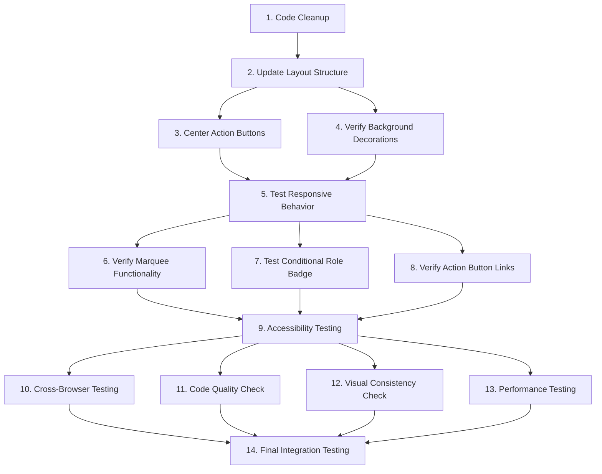

# Tasks: Center Hero Section Content

## Overview
Implementation tasks for centering the Hero section content by removing the initials box and restructuring the layout.

---

## 1. Code Cleanup
**Description**: Remove unused code related to the initials box
**Requirements**: FR1
**Estimated Effort**: 5 minutes

### Subtasks:
- [x] 1.1 Remove the `initials()` helper function from Hero.tsx
- [x] 1.2 Remove the right column div containing the initials box
- [x] 1.3 Remove the dotted background pattern div associated with the initials box
- [x] 1.4 Verify no unused imports remain after removal

---

## 2. Update Layout Structure
**Description**: Convert from two-column grid to single centered column layout
**Requirements**: FR2, FR3
**Estimated Effort**: 10 minutes

### Subtasks:
- [x] 2.1 Remove grid layout classes (`grid`, `lg:grid-cols-2`, `gap-10`, `lg:gap-12`) from container div
- [x] 2.2 Add flexbox centering classes (`flex`, `flex-col`, `items-center`) to container div
- [x] 2.3 Add `text-center` class to content wrapper for centered text alignment
- [x] 2.4 Update content wrapper with `max-w-2xl` and `mx-auto` for optimal width constraint
- [x] 2.5 Remove `relative` class from left column div (no longer needed)

---

## 3. Center Action Buttons
**Description**: Ensure action buttons are horizontally centered
**Requirements**: FR7
**Estimated Effort**: 2 minutes

### Subtasks:
- [x] 3.1 Add `justify-center` class to button container div
- [x] 3.2 Verify buttons maintain `flex-wrap` behavior for responsive wrapping

---

## 4. Verify Background Decorations
**Description**: Ensure background elements remain visible and properly positioned
**Requirements**: FR4
**Estimated Effort**: 5 minutes

### Subtasks:
- [x] 4.1 Verify BackgroundShapes component still renders correctly
- [x] 4.2 Verify decorative circle positioning is still appropriate
- [x] 4.3 Verify z-index layering (decorations behind content)
- [x] 4.4 Check that decorations don't interfere with centered content readability

---

## 5. Test Responsive Behavior
**Description**: Verify layout works correctly across all viewport sizes
**Requirements**: NFR1
**Estimated Effort**: 15 minutes

### Subtasks:
- [x] 5.1 Test on mobile viewport (320px - 767px)
- [x] 5.2 Test on tablet viewport (768px - 1023px)
- [x] 5.3 Test on desktop viewport (1024px and above)
- [x] 5.4 Test on extra-large viewport (1920px and above)
- [x] 5.5 Verify no horizontal scrolling on any viewport size
- [x] 5.6 Verify content spacing and readability on all devices

---

## 6. Verify Marquee Functionality
**Description**: Ensure Marquee component continues to work correctly
**Requirements**: FR5
**Estimated Effort**: 5 minutes

### Subtasks:
- [x] 6.1 Verify Marquee receives correct items array
- [x] 6.2 Verify Marquee renders at the bottom of the Hero section
- [x] 6.3 Verify Marquee spans full viewport width
- [x] 6.4 Verify Marquee animation works smoothly
- [x] 6.5 Test with empty headline to ensure filtering works

---

## 7. Test Conditional Role Badge
**Description**: Verify role badge displays correctly based on experience data
**Requirements**: FR6
**Estimated Effort**: 5 minutes

### Subtasks:
- [x] 7.1 Verify role badge displays when experience[0] exists
- [x] 7.2 Verify role badge styling is maintained (border, shadow, accent dot)
- [x] 7.3 Test with empty experience array (temporarily modify data)
- [x] 7.4 Verify role badge is centered with other content

---

## 8. Verify Action Button Links
**Description**: Ensure Email and LinkedIn buttons work correctly
**Requirements**: FR7
**Estimated Effort**: 3 minutes

### Subtasks:
- [x] 8.1 Verify Email button links to correct mailto: address
- [x] 8.2 Verify LinkedIn button links to correct profile URL
- [x] 8.3 Verify button styling is maintained (primary and secondary variants)
- [x] 8.4 Test button keyboard accessibility (tab navigation)

---

## 9. Accessibility Testing
**Description**: Verify accessibility standards are maintained
**Requirements**: NFR3
**Estimated Effort**: 10 minutes

### Subtasks:
- [x] 9.1 Verify heading hierarchy (h1 for name)
- [x] 9.2 Test keyboard navigation through all interactive elements
- [x] 9.3 Verify focus indicators are visible
- [x] 9.4 Run axe DevTools accessibility scan
- [x] 9.5 Test with screen reader (if available)
- [x] 9.6 Verify ARIA labels are present (MapPin icon)

---

## 10. Cross-Browser Testing
**Description**: Verify layout works in all modern browsers
**Requirements**: NFR4
**Estimated Effort**: 10 minutes

### Subtasks:
- [x] 10.1 Test in Chrome (latest version)
- [x] 10.2 Test in Firefox (latest version)
- [x] 10.3 Test in Safari (latest version)
- [x] 10.4 Test in Edge (latest version)
- [x] 10.5 Verify flexbox support in all browsers

---

## 11. Code Quality Check
**Description**: Ensure code is clean and maintainable
**Requirements**: NFR5
**Estimated Effort**: 5 minutes

### Subtasks:
- [x] 11.1 Run ESLint and fix any warnings
- [x] 11.2 Verify no commented-out code remains
- [x] 11.3 Verify TypeScript types are correct
- [x] 11.4 Verify no unused variables or imports
- [x] 11.5 Review code for readability and clarity

---

## 12. Visual Consistency Check
**Description**: Verify visual consistency with design system
**Requirements**: NFR6
**Estimated Effort**: 5 minutes

### Subtasks:
- [x] 12.1 Verify spacing matches design system
- [x] 12.2 Verify typography is consistent
- [x] 12.3 Verify color scheme matches palette
- [x] 12.4 Verify border styles and shadows are consistent
- [x] 12.5 Compare with other sections for visual harmony

---

## 13. Performance Testing
**Description**: Verify performance is maintained or improved
**Requirements**: NFR2
**Estimated Effort**: 5 minutes

### Subtasks:
- [x] 13.1 Run Lighthouse performance audit
- [x] 13.2 Verify no layout shift (CLS) during render
- [x] 13.3 Verify Hero section renders quickly
- [x] 13.4 Check DOM node count reduction

---

## 14. Final Integration Testing
**Description**: Verify Hero section works correctly with the rest of the application
**Requirements**: All
**Estimated Effort**: 10 minutes

### Subtasks:
- [x] 14.1 Verify Hero section renders correctly on page load
- [x] 14.2 Verify no breaking changes in other sections
- [x] 14.3 Verify smooth scrolling to Hero section (if applicable)
- [x] 14.4 Test full page flow from Hero to other sections
- [x] 14.5 Verify no console errors or warnings

---

## Task Dependencies

---

## Estimated Total Effort

- **Code Changes**: ~20 minutes
- **Testing**: ~50 minutes
- **Quality Assurance**: ~20 minutes
- **Total**: ~90 minutes (1.5 hours)

---

## Definition of Done

A task is considered complete when:
- [ ] All subtasks are completed
- [ ] Code changes are implemented correctly
- [ ] Tests pass (manual or automated)
- [ ] No ESLint warnings or errors
- [ ] No TypeScript errors
- [ ] Visual appearance matches design intent
- [ ] Accessibility standards are met
- [ ] Performance is maintained or improved
- [ ] Code is reviewed and approved (if applicable)

---

## Notes

- Tasks 1-4 are implementation tasks (code changes)
- Tasks 5-13 are verification tasks (testing and quality assurance)
- Task 14 is final integration testing
- Tasks can be executed in parallel where dependencies allow
- Some testing tasks (9-13) can be performed concurrently
- Prioritize tasks 1-3 for immediate visual impact
