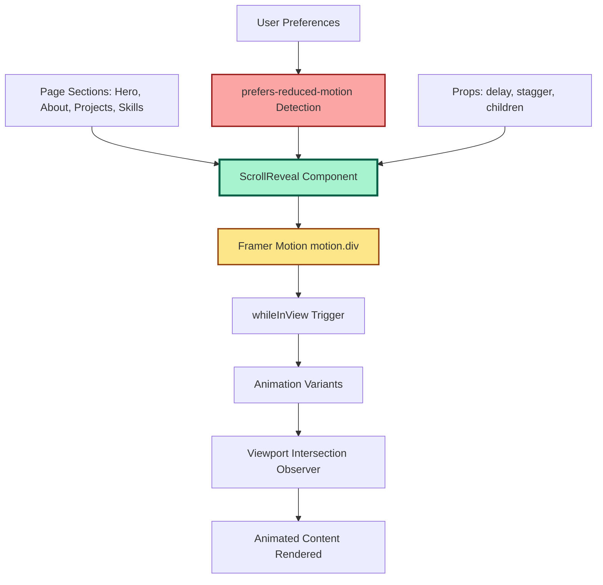
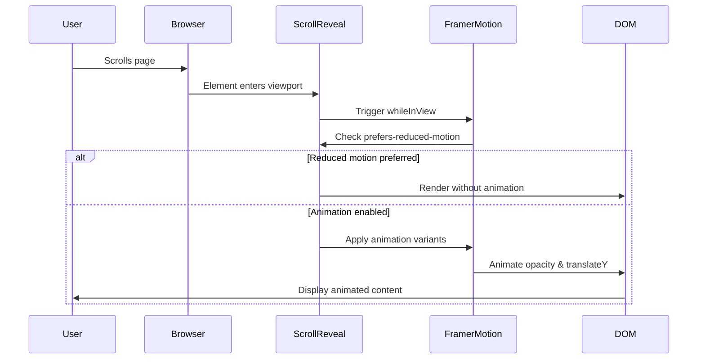

# Design Document: Scroll-Based Animations with Framer Motion

## Overview

This feature adds smooth, performant scroll-based animations to a React 19 + TypeScript portfolio application using Framer Motion. The design centers around a reusable `ScrollReveal` component that wraps content and triggers fade-in and slide-up animations when elements enter the viewport. The component supports staggered animations for multiple children, custom delays, and respects user accessibility preferences (prefers-reduced-motion). The implementation integrates seamlessly with the existing Tailwind CSS styling system and maintains the project's TypeScript-first approach with strict type safety.

The architecture follows React best practices with a composable, declarative API that allows developers to wrap any content with scroll animations using a simple component interface. Performance is optimized through Framer Motion's efficient animation engine and viewport intersection observers, ensuring smooth 60fps animations even on mobile devices.

## Architecture



### Component Flow



## Components and Interfaces

### Component 1: ScrollReveal

**Purpose**: A reusable wrapper component that applies scroll-triggered animations to its children using Framer Motion's `whileInView` prop. It handles viewport detection, animation timing, staggered animations, and accessibility concerns.

**Interface**:
```typescript
interface ScrollRevealProps {
  children: React.ReactNode
  delay?: number
  stagger?: number
  className?: string
  variants?: {
    hidden: Variant
    visible: Variant
  }
}

type Variant = {
  opacity?: number
  y?: number
  transition?: {
    duration?: number
    ease?: string | number[]
    delay?: number
    staggerChildren?: number
  }
}
```

**Responsibilities**:
- Detect when wrapped content enters the viewport
- Apply fade-in and slide-up animations with configurable timing
- Support staggered animations for multiple children
- Respect `prefers-reduced-motion` media query for accessibility
- Provide sensible default animation values
- Allow custom animation variants for advanced use cases
- Ensure animations run only once per element (viewport: { once: true })

### Component 2: Framer Motion Integration

**Purpose**: Leverage Framer Motion's `motion.div` and `whileInView` to handle the animation lifecycle and viewport intersection detection efficiently.

**Interface**:
```typescript
import { motion, Variant } from 'framer-motion'

// motion.div props used
interface MotionDivProps {
  initial: string | Variant
  whileInView: string | Variant
  viewport: {
    once: boolean
    margin?: string
    amount?: number | 'some' | 'all'
  }
  variants?: Record<string, Variant>
  transition?: Transition
}
```

**Responsibilities**:
- Provide the underlying animation engine
- Handle viewport intersection observation
- Manage animation state transitions
- Optimize performance with hardware acceleration
- Support CSS transform and opacity animations

## Data Models

### Model 1: ScrollRevealProps

```typescript
interface ScrollRevealProps {
  /** Content to be animated */
  children: React.ReactNode
  
  /** Delay before animation starts (in seconds) */
  delay?: number
  
  /** Stagger delay between child animations (in seconds) */
  stagger?: number
  
  /** Additional CSS classes to apply to the wrapper */
  className?: string
  
  /** Custom animation variants (overrides defaults) */
  variants?: {
    hidden: Variant
    visible: Variant
  }
}
```

**Validation Rules**:
- `children` must be a valid React node (required)
- `delay` must be a non-negative number (optional, default: 0)
- `stagger` must be a non-negative number (optional, default: 0)
- `className` must be a valid string (optional)
- `variants` must conform to Framer Motion's Variant type (optional)

### Model 2: AnimationVariants

```typescript
type AnimationVariants = {
  hidden: Variant
  visible: Variant
}

type Variant = {
  opacity?: number
  y?: number | string
  transition?: {
    duration?: number
    ease?: string | number[]
    delay?: number
    staggerChildren?: number
  }
}
```

**Validation Rules**:
- `opacity` must be between 0 and 1
- `y` must be a number (pixels) or valid CSS string
- `duration` must be a positive number (seconds)
- `ease` must be a valid easing function name or cubic-bezier array
- `delay` must be a non-negative number
- `staggerChildren` must be a non-negative number

### Model 3: ViewportOptions

```typescript
type ViewportOptions = {
  once: boolean
  margin?: string
  amount?: number | 'some' | 'all'
}
```

**Validation Rules**:
- `once` is boolean (required, default: true)
- `margin` must be valid CSS margin string (optional, e.g., "-100px")
- `amount` must be between 0-1 or 'some'/'all' (optional, default: 0.3)

## Algorithmic Pseudocode

### Main Animation Algorithm

```typescript
ALGORITHM renderScrollReveal(props: ScrollRevealProps)
INPUT: props containing children, delay, stagger, className, variants
OUTPUT: Animated React element

BEGIN
  // Step 1: Check for reduced motion preference
  prefersReducedMotion ← window.matchMedia('(prefers-reduced-motion: reduce)').matches
  
  // Step 2: Define default animation variants
  defaultVariants ← {
    hidden: { opacity: 0, y: 40 },
    visible: {
      opacity: 1,
      y: 0,
      transition: {
        duration: 0.6,
        ease: [0.25, 0.1, 0.25, 1], // easeOut
        delay: props.delay || 0,
        staggerChildren: props.stagger || 0
      }
    }
  }
  
  // Step 3: Merge custom variants with defaults
  finalVariants ← props.variants ? props.variants : defaultVariants
  
  // Step 4: Configure viewport options
  viewportConfig ← {
    once: true,
    amount: 0.3,
    margin: "0px 0px -100px 0px"
  }
  
  // Step 5: Render based on motion preference
  IF prefersReducedMotion THEN
    // Render without animation
    RETURN <div className={props.className}>{props.children}</div>
  ELSE
    // Render with animation
    RETURN (
      <motion.div
        initial="hidden"
        whileInView="visible"
        viewport={viewportConfig}
        variants={finalVariants}
        className={props.className}
      >
        {props.children}
      </motion.div>
    )
  END IF
END
```

**Preconditions:**
- Framer Motion library is installed and imported
- props.children is a valid React node
- Browser supports Intersection Observer API (or Framer Motion polyfill is available)

**Postconditions:**
- Returns a valid React element
- Animation respects user's motion preferences
- Element animates when entering viewport (if motion enabled)
- Animation runs only once per element

**Loop Invariants:** N/A (no explicit loops in main algorithm)

### Stagger Animation Algorithm

```typescript
ALGORITHM applyStaggerAnimation(children: ReactNode[], stagger: number)
INPUT: Array of child elements, stagger delay in seconds
OUTPUT: Animated children with staggered timing

BEGIN
  // Step 1: Validate stagger value
  ASSERT stagger >= 0
  
  // Step 2: Configure parent variant with staggerChildren
  parentVariant ← {
    visible: {
      transition: {
        staggerChildren: stagger
      }
    }
  }
  
  // Step 3: Configure child variants
  childVariant ← {
    hidden: { opacity: 0, y: 20 },
    visible: {
      opacity: 1,
      y: 0,
      transition: { duration: 0.4 }
    }
  }
  
  // Step 4: Wrap parent with motion.div
  RETURN (
    <motion.div
      initial="hidden"
      whileInView="visible"
      variants={parentVariant}
    >
      FOR each child IN children DO
        <motion.div variants={childVariant}>
          {child}
        </motion.div>
      END FOR
    </motion.div>
  )
END
```

**Preconditions:**
- children is a valid array of React nodes
- stagger is a non-negative number
- Parent motion.div has staggerChildren configured

**Postconditions:**
- Each child animates with incremental delay
- Stagger delay is applied sequentially
- All children use consistent animation variants

**Loop Invariants:**
- Each child receives the same animation variant
- Stagger timing increases linearly for each child

### Reduced Motion Detection Algorithm

```typescript
ALGORITHM detectReducedMotion()
INPUT: None (reads from browser environment)
OUTPUT: Boolean indicating if reduced motion is preferred

BEGIN
  // Step 1: Check if matchMedia is supported
  IF typeof window === 'undefined' OR !window.matchMedia THEN
    RETURN false  // Default to animations enabled (SSR safe)
  END IF
  
  // Step 2: Query media preference
  mediaQuery ← window.matchMedia('(prefers-reduced-motion: reduce)')
  
  // Step 3: Return preference
  RETURN mediaQuery.matches
END
```

**Preconditions:**
- Code runs in browser environment (not during SSR)
- window.matchMedia API is available

**Postconditions:**
- Returns true if user prefers reduced motion
- Returns false if animations should be enabled
- Safe to call during component render

**Loop Invariants:** N/A

## Key Functions with Formal Specifications

### Function 1: ScrollReveal Component

```typescript
function ScrollReveal({
  children,
  delay = 0,
  stagger = 0,
  className = '',
  variants
}: ScrollRevealProps): JSX.Element
```

**Preconditions:**
- `children` is a valid React node (not null/undefined)
- `delay` is a non-negative number
- `stagger` is a non-negative number
- Framer Motion is installed and available

**Postconditions:**
- Returns a valid JSX element
- Element respects prefers-reduced-motion setting
- Animation triggers when element enters viewport
- Animation runs only once (viewport.once = true)
- No side effects on input props

**Loop Invariants:** N/A

### Function 2: useReducedMotion Hook (Optional Utility)

```typescript
function useReducedMotion(): boolean
```

**Preconditions:**
- Hook is called within a React component
- Browser environment (not SSR)

**Postconditions:**
- Returns boolean indicating motion preference
- Updates when user changes system preference
- Safe for SSR (returns false during server render)

**Loop Invariants:** N/A

### Function 3: getDefaultVariants

```typescript
function getDefaultVariants(delay: number, stagger: number): AnimationVariants
```

**Preconditions:**
- `delay` is a non-negative number
- `stagger` is a non-negative number

**Postconditions:**
- Returns valid AnimationVariants object
- Includes hidden and visible states
- Transition timing includes delay and stagger
- No mutations to input parameters

**Loop Invariants:** N/A

## Example Usage

```typescript
// Example 1: Basic usage - Hero section
import { ScrollReveal } from '@/components/animations/ScrollReveal'

export function Hero() {
  return (
    <section id="hero">
      <ScrollReveal>
        <h1>Welcome to My Portfolio</h1>
        <p>Full-stack developer specializing in React and TypeScript</p>
      </ScrollReveal>
    </section>
  )
}

// Example 2: With delay - About section
export function About() {
  return (
    <Section id="about" title="About Me">
      <ScrollReveal delay={0.2}>
        <div className="rounded-xl border-2 p-6">
          <p>I'm a passionate developer...</p>
        </div>
      </ScrollReveal>
    </Section>
  )
}

// Example 3: Staggered children - Projects grid
export function Projects() {
  const projects = [
    { id: 1, name: 'Project A' },
    { id: 2, name: 'Project B' },
    { id: 3, name: 'Project C' }
  ]
  
  return (
    <Section id="projects" title="My Projects">
      <div className="grid gap-8 md:grid-cols-3">
        {projects.map((project, index) => (
          <ScrollReveal key={project.id} delay={index * 0.1}>
            <StickerCard title={project.name}>
              {/* Project content */}
            </StickerCard>
          </ScrollReveal>
        ))}
      </div>
    </Section>
  )
}

// Example 4: Skills chips with stagger
export function Skills() {
  const skills = ['React', 'TypeScript', 'Node.js', 'PostgreSQL']
  
  return (
    <Section id="skills" title="Skills">
      <ScrollReveal stagger={0.05}>
        <div className="flex flex-wrap gap-2">
          {skills.map(skill => (
            <Chip key={skill}>{skill}</Chip>
          ))}
        </div>
      </ScrollReveal>
    </Section>
  )
}

// Example 5: Custom variants for advanced animations
export function CustomAnimation() {
  const customVariants = {
    hidden: { opacity: 0, scale: 0.8, rotate: -10 },
    visible: {
      opacity: 1,
      scale: 1,
      rotate: 0,
      transition: { duration: 0.8, ease: 'easeOut' }
    }
  }
  
  return (
    <ScrollReveal variants={customVariants}>
      <div>Custom animated content</div>
    </ScrollReveal>
  )
}

// Example 6: Complete workflow with error boundary
import { ErrorBoundary } from 'react-error-boundary'

export function SafeAnimatedSection() {
  return (
    <ErrorBoundary fallback={<div>Animation failed to load</div>}>
      <ScrollReveal delay={0.3}>
        <div className="content">
          <h2>Safely Animated Content</h2>
        </div>
      </ScrollReveal>
    </ErrorBoundary>
  )
}
```

## Correctness Properties

### Property 1: Animation Triggers on Viewport Entry
**Statement**: ∀ element wrapped in ScrollReveal, when element enters viewport → animation executes exactly once

**Verification**: 
- Framer Motion's `whileInView` with `viewport.once: true` ensures single execution
- Intersection Observer API guarantees viewport detection
- Test: Scroll element into view, verify animation plays once, scroll away and back, verify no re-animation

### Property 2: Reduced Motion Compliance
**Statement**: ∀ users with prefers-reduced-motion enabled → no animations execute

**Verification**:
- Component checks `window.matchMedia('(prefers-reduced-motion: reduce)')`
- When true, renders plain div without motion.div wrapper
- Test: Enable reduced motion in OS settings, verify no animations play

### Property 3: Stagger Timing Consistency
**Statement**: ∀ children in staggered animation, child[i] starts after child[i-1] by exactly `stagger` seconds

**Verification**:
- Framer Motion's `staggerChildren` applies linear delay
- Each child receives incremental delay: delay[i] = delay[0] + (i * stagger)
- Test: Measure animation start times, verify linear progression

### Property 4: No Layout Shift
**Statement**: ∀ animated elements → layout position remains stable during animation

**Verification**:
- Animations use `opacity` and `transform` (GPU-accelerated, no reflow)
- No changes to `width`, `height`, `margin`, or `padding` during animation
- Test: Monitor Cumulative Layout Shift (CLS) metric, verify CLS = 0

### Property 5: Performance Threshold
**Statement**: ∀ animations → frame rate ≥ 60fps on modern devices

**Verification**:
- Framer Motion uses hardware-accelerated CSS transforms
- Animations run on compositor thread (not main thread)
- Test: Use Chrome DevTools Performance tab, verify no frame drops

### Property 6: Type Safety
**Statement**: ∀ prop combinations → TypeScript compiler prevents invalid usage

**Verification**:
- All props have explicit TypeScript types
- Invalid prop types cause compile-time errors
- Test: Attempt to pass wrong types, verify TypeScript errors

### Property 7: SSR Compatibility
**Statement**: Component renders without errors during server-side rendering

**Verification**:
- No direct window/document access during render
- Reduced motion check includes typeof window check
- Test: Render component in Node.js environment, verify no crashes

## Error Handling

### Error Scenario 1: Framer Motion Not Installed

**Condition**: Developer attempts to use ScrollReveal without installing framer-motion package

**Response**: 
- TypeScript compilation fails with module not found error
- Clear error message: "Cannot find module 'framer-motion'"

**Recovery**: 
- Install framer-motion: `npm install framer-motion`
- Restart development server

### Error Scenario 2: Invalid Prop Types

**Condition**: Developer passes incorrect prop types (e.g., string for delay instead of number)

**Response**:
- TypeScript compiler error at build time
- Error message indicates expected vs actual type

**Recovery**:
- Fix prop type to match interface definition
- TypeScript IntelliSense provides correct type hints

### Error Scenario 3: Browser Lacks Intersection Observer Support

**Condition**: User's browser doesn't support Intersection Observer API (very old browsers)

**Response**:
- Framer Motion includes fallback behavior
- Animation may not trigger on scroll, but content remains visible

**Recovery**:
- Content is still accessible (graceful degradation)
- Consider adding Intersection Observer polyfill for legacy support

### Error Scenario 4: Children Prop Missing

**Condition**: Developer uses ScrollReveal without children

**Response**:
- TypeScript error: "Property 'children' is missing"
- Component renders empty div if somehow bypassed

**Recovery**:
- Add children content to ScrollReveal wrapper
- TypeScript prevents this at compile time

### Error Scenario 5: Animation Performance Issues

**Condition**: Too many simultaneous animations cause frame drops

**Response**:
- Browser may skip frames to maintain responsiveness
- Animations may appear choppy

**Recovery**:
- Reduce number of simultaneous animations
- Increase stagger delay to spread out animation load
- Use `will-change` CSS hint for complex animations

### Error Scenario 6: SSR Hydration Mismatch

**Condition**: Server-rendered HTML doesn't match client-rendered output

**Response**:
- React hydration warning in console
- Potential flash of unstyled content

**Recovery**:
- Ensure reduced motion detection is SSR-safe
- Use `useEffect` for client-only motion detection if needed

## Testing Strategy

### Unit Testing Approach

**Framework**: Vitest + React Testing Library

**Key Test Cases**:

1. **Rendering Tests**
   - Component renders children correctly
   - Component applies custom className
   - Component renders without errors

2. **Prop Tests**
   - Default props are applied correctly
   - Custom delay prop affects animation timing
   - Custom stagger prop affects child animations
   - Custom variants override defaults

3. **Accessibility Tests**
   - Reduced motion preference is respected
   - Component renders plain div when motion disabled
   - No animation classes applied with reduced motion

4. **Type Tests**
   - TypeScript compilation succeeds with valid props
   - TypeScript errors on invalid prop types

**Example Unit Test**:
```typescript
import { render, screen } from '@testing-library/react'
import { ScrollReveal } from './ScrollReveal'

describe('ScrollReveal', () => {
  it('renders children correctly', () => {
    render(
      <ScrollReveal>
        <div data-testid="child">Test Content</div>
      </ScrollReveal>
    )
    expect(screen.getByTestId('child')).toBeInTheDocument()
  })
  
  it('respects reduced motion preference', () => {
    // Mock matchMedia to return reduced motion
    window.matchMedia = vi.fn().mockImplementation(query => ({
      matches: query === '(prefers-reduced-motion: reduce)',
      media: query,
      addEventListener: vi.fn(),
      removeEventListener: vi.fn()
    }))
    
    const { container } = render(
      <ScrollReveal>
        <div>Content</div>
      </ScrollReveal>
    )
    
    // Should render plain div, not motion.div
    expect(container.firstChild).not.toHaveAttribute('data-framer-motion')
  })
})
```

### Property-Based Testing Approach

**Property Test Library**: fast-check (JavaScript/TypeScript property-based testing)

**Properties to Test**:

1. **Delay Property**: ∀ delay ∈ [0, 5] → animation starts after delay seconds
2. **Stagger Property**: ∀ stagger ∈ [0, 1], ∀ n children → child[i] starts at delay + (i * stagger)
3. **Opacity Property**: ∀ animation states → opacity ∈ [0, 1]
4. **Transform Property**: ∀ y values → translateY is valid CSS value

**Example Property Test**:
```typescript
import fc from 'fast-check'
import { getDefaultVariants } from './ScrollReveal'

describe('ScrollReveal Properties', () => {
  it('delay is always non-negative', () => {
    fc.assert(
      fc.property(
        fc.float({ min: 0, max: 10 }),
        fc.float({ min: 0, max: 2 }),
        (delay, stagger) => {
          const variants = getDefaultVariants(delay, stagger)
          const actualDelay = variants.visible.transition?.delay ?? 0
          return actualDelay >= 0 && actualDelay === delay
        }
      )
    )
  })
  
  it('opacity values are always between 0 and 1', () => {
    fc.assert(
      fc.property(
        fc.float({ min: 0, max: 10 }),
        fc.float({ min: 0, max: 2 }),
        (delay, stagger) => {
          const variants = getDefaultVariants(delay, stagger)
          const hiddenOpacity = variants.hidden.opacity ?? 1
          const visibleOpacity = variants.visible.opacity ?? 1
          return (
            hiddenOpacity >= 0 && hiddenOpacity <= 1 &&
            visibleOpacity >= 0 && visibleOpacity <= 1
          )
        }
      )
    )
  })
})
```

### Integration Testing Approach

**Framework**: Playwright or Cypress for E2E testing

**Integration Test Scenarios**:

1. **Scroll Trigger Test**
   - Load page with ScrollReveal components
   - Scroll to trigger animations
   - Verify elements animate into view
   - Verify animations run only once

2. **Multiple Sections Test**
   - Load page with multiple animated sections
   - Scroll through entire page
   - Verify each section animates independently
   - Verify no performance degradation

3. **Stagger Animation Test**
   - Load page with staggered children
   - Scroll to trigger stagger
   - Verify children animate sequentially
   - Measure timing between animations

4. **Reduced Motion Test**
   - Enable reduced motion in browser
   - Load page with animations
   - Verify no animations execute
   - Verify content is still visible

**Example Integration Test**:
```typescript
import { test, expect } from '@playwright/test'

test('scroll animations trigger on viewport entry', async ({ page }) => {
  await page.goto('/')
  
  // Get initial opacity of animated element
  const element = page.locator('[data-testid="animated-section"]')
  const initialOpacity = await element.evaluate(el => 
    window.getComputedStyle(el).opacity
  )
  
  // Element should be hidden initially
  expect(parseFloat(initialOpacity)).toBeLessThan(0.5)
  
  // Scroll element into view
  await element.scrollIntoViewIfNeeded()
  
  // Wait for animation to complete
  await page.waitForTimeout(1000)
  
  // Element should be fully visible
  const finalOpacity = await element.evaluate(el =>
    window.getComputedStyle(el).opacity
  )
  expect(parseFloat(finalOpacity)).toBe(1)
})

test('respects prefers-reduced-motion', async ({ page, context }) => {
  // Enable reduced motion
  await context.emulateMedia({ reducedMotion: 'reduce' })
  
  await page.goto('/')
  
  const element = page.locator('[data-testid="animated-section"]')
  
  // Element should be immediately visible (no animation)
  const opacity = await element.evaluate(el =>
    window.getComputedStyle(el).opacity
  )
  expect(parseFloat(opacity)).toBe(1)
})
```

## Performance Considerations

### Animation Performance

**Optimization Strategies**:
1. **GPU Acceleration**: Use `transform` and `opacity` properties (GPU-accelerated)
2. **Avoid Layout Thrashing**: No changes to layout properties during animation
3. **Compositor Thread**: Animations run on compositor thread, not main thread
4. **will-change Hint**: Framer Motion automatically applies `will-change` for optimized animations

**Performance Targets**:
- 60fps on desktop devices
- 60fps on modern mobile devices (iPhone 12+, Android flagship)
- 30fps minimum on older mobile devices
- Animation duration: 0.6-0.8s (optimal for perceived performance)

### Bundle Size Impact

**Framer Motion Bundle Size**:
- Core library: ~30KB gzipped
- Tree-shakeable: Only import what you use
- Motion components: ~5KB additional per component type

**Mitigation**:
- Use named imports to enable tree-shaking
- Consider code-splitting for animation-heavy routes
- Lazy load ScrollReveal component if not needed immediately

### Viewport Intersection Performance

**Optimization**:
- Framer Motion uses efficient Intersection Observer API
- Observers are reused across multiple elements
- `viewport.once: true` removes observers after first trigger

**Best Practices**:
- Limit number of simultaneously observed elements
- Use `viewport.margin` to trigger animations slightly before element enters view
- Set `viewport.amount` to trigger at optimal scroll position

### Mobile Performance

**Considerations**:
- Mobile devices have less GPU power
- Touch scrolling can be rapid and unpredictable
- Battery life concerns with excessive animations

**Optimizations**:
- Shorter animation durations on mobile (0.4-0.6s)
- Reduce number of simultaneous animations
- Consider disabling animations on low-end devices
- Use `matchMedia` to detect device capabilities

## Security Considerations

### XSS Prevention

**Risk**: User-provided content in animated elements could contain malicious scripts

**Mitigation**:
- React's built-in XSS protection (automatic escaping)
- Never use `dangerouslySetInnerHTML` within ScrollReveal
- Sanitize any user-generated content before rendering

### Dependency Security

**Risk**: Framer Motion dependency could have vulnerabilities

**Mitigation**:
- Regularly update framer-motion to latest stable version
- Monitor security advisories (npm audit, Snyk, Dependabot)
- Review Framer Motion's security track record (well-maintained, popular library)

### Motion-Based Attacks

**Risk**: Rapid animations could trigger photosensitive epilepsy

**Mitigation**:
- Respect prefers-reduced-motion setting
- Avoid rapid flashing or strobing effects
- Keep animation durations reasonable (0.6-0.8s)
- Provide user control to disable animations

### Privacy Considerations

**Risk**: Animation behavior could be used for fingerprinting

**Mitigation**:
- No tracking or analytics in animation component
- No external network requests
- Animation behavior is deterministic and standard

## Dependencies

### Required Dependencies

1. **framer-motion** (^11.0.0 or latest)
   - Purpose: Animation library for React
   - License: MIT
   - Bundle size: ~30KB gzipped
   - Installation: `npm install framer-motion`

2. **react** (^19.2.5)
   - Purpose: UI library (already installed)
   - Required for component rendering

3. **react-dom** (^19.2.5)
   - Purpose: React DOM rendering (already installed)

### Development Dependencies

1. **@types/react** (^19.2.14)
   - Purpose: TypeScript types for React (already installed)

2. **typescript** (~6.0.2)
   - Purpose: Type checking (already installed)

3. **vitest** (optional, for testing)
   - Purpose: Unit testing framework
   - Installation: `npm install -D vitest`

4. **@testing-library/react** (optional, for testing)
   - Purpose: React component testing utilities
   - Installation: `npm install -D @testing-library/react`

5. **fast-check** (optional, for property-based testing)
   - Purpose: Property-based testing library
   - Installation: `npm install -D fast-check`

### Peer Dependencies

- React 18+ (compatible with React 19)
- TypeScript 5+ (compatible with TypeScript 6)

### Browser Compatibility

**Minimum Requirements**:
- Chrome 90+
- Firefox 88+
- Safari 14+
- Edge 90+

**Polyfills** (if supporting older browsers):
- Intersection Observer polyfill for IE11 (not recommended)
- ResizeObserver polyfill for older browsers

### Integration with Existing Stack

**Tailwind CSS**: 
- No conflicts, animations work alongside Tailwind classes
- Can combine with Tailwind transitions if needed

**Vite**:
- Framer Motion works seamlessly with Vite
- No special configuration required
- Fast HMR with animation updates

**TypeScript**:
- Framer Motion includes TypeScript definitions
- Full type safety for all animation props
- IntelliSense support in VS Code
